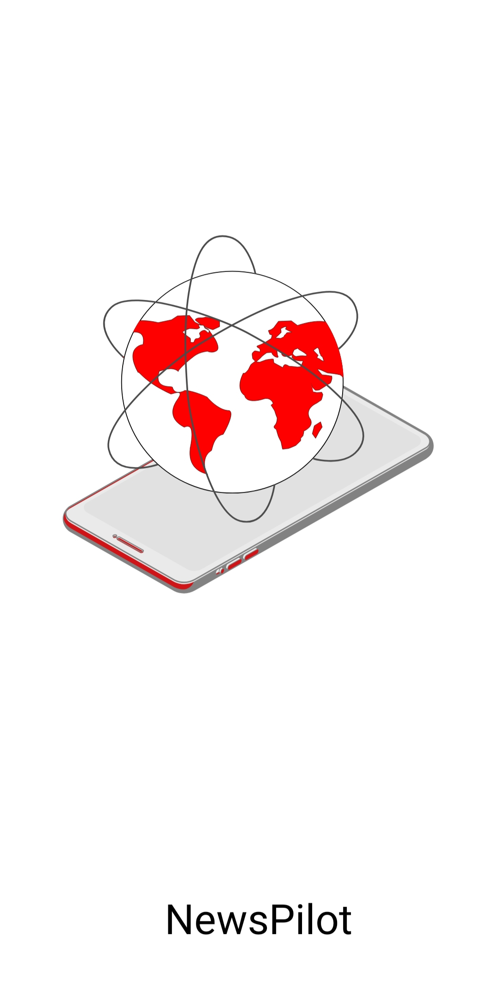

## NewsPilot Android App
NewsPilot is an Android application that fetches news from NewsAPI for three categories, financial, sports, and entertainment. The application also allows users to customize the category of feed by manually entering the required parameters such as country, category, and from date to fetch data according to users requirment from the API.

## Table of Contents
<ol>
<li>Features</li>
<li>Getting Started</li>
<li>Usage</li>
<li>Contributing</li>
</ol>

## Features
* Fetches news from NewsAPI for financial, sports, and entertainment categories.
* Allows users customize the category of news by manually entering parameters such as country, category, and from date.
* Displays news articles in a clean and easy-to-read format.
* Users can navigate to supporting news article on internet by clicking news titles in app.

## Getting Started
To get started with the NewsPilot app, follow these steps:
<ol>
<li>Clone the repository to your local machine.</li>
<li>Open the project in Android Studio.</li>
<li>Create a NewsAPI account by visiting https://newsapi.org/ and obtain an API key.</li>
<li>Replace the API key in the NewsScreen.java file with your own API key.</li>
<li>Build and run the app on your Android device or emulator.</li>
</ol>

## Usage
<ol>
<li>Open the NewsPilot app on your Android device.</li>
<li>Select one of the three categories: financial, sports, or entertainment.</li>
<li>Optionally, you can enter additional parameters such as country, category, or from date to get customized news category or refine your search.</li>
<li>Tap the "Read News" button to fetch news articles.</li>
<li>Browse through the articles by swiping up or down.</li>
<li>Tap on an article to read it in detail.</li>
</ol>

## Contributing
If you want to contribute to the NewsPilot app, you can:

* Open an issue to report a bug or suggest a feature.
* Fork the repository, make changes, and create a pull request.
